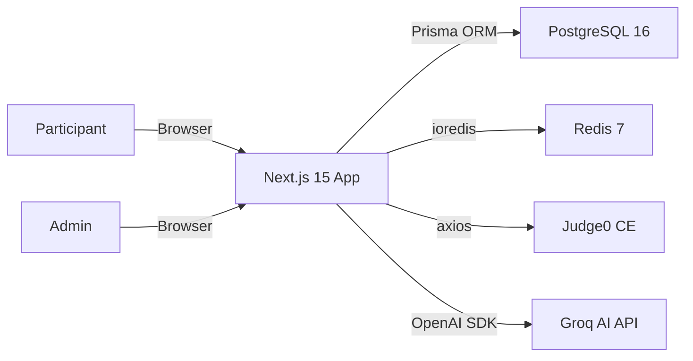

# 00 — Start Here

**Purpose:** Onboard a new developer or AI coding agent in ~10 minutes  
**Audience:** All Developers / AI Agents  
**Last Generated:** 2026-08-31  
**Source of Truth:** Repository implementation

---

## What Is ByteVerse?

ByteVerse is a **real-time, duo-based competitive programming platform** built for a college technical fest (NSDC at VCET, Vasai). Instead of making participants juggle between external tools, ByteVerse provides a unified competition environment with an integrated code editor, AI assistance, automated judging, anti-cheat enforcement, and live scoring — all in one web application.

## Why Does This Platform Exist?

Traditional coding competitions rely on external judges (Codeforces, HackerRank) and separate communication channels. ByteVerse consolidates everything:
- **Problem delivery** → built-in per-round problem renderer
- **Code editing** → Monaco Editor (VS Code engine)
- **Code execution** → Judge0 CE integration (self-hosted or remote)
- **AI assistance** → Groq-powered Socratic tutoring with score penalties
- **Anti-cheat** → Client-side fullscreen/tab/blur enforcement with proctor PIN unlock
- **Live scoring & leaderboards** → Redis pub/sub with real-time cache invalidation

## Main Users

| Actor | Description |
|-------|-------------|
| **Participant** | A student competing in a duo team |
| **Organizer** | Event staff with elevated permissions |
| **Admin / Super Admin** | Full control: start/stop rounds, manage problems, view violations |

## Major Subsystems

```
┌─────────────────────────────────────────────────────────┐
│                    BYTEVERSE PLATFORM                    │
├──────────┬──────────┬──────────┬──────────┬─────────────┤
│ Auth     │ Rounds   │ Judge0   │ AI Gate  │ Anti-Cheat  │
│ NextAuth │ 5 Types  │ Code     │ Groq     │ Fullscreen  │
│ JWT+Cred │ MCQ/Code │ Executor │ Socratic │ Tab/Blur    │
├──────────┴──────────┴──────────┴──────────┴─────────────┤
│           PostgreSQL  +  Redis  +  Prisma ORM           │
└─────────────────────────────────────────────────────────┘
```

## Simplified Architecture



## Important Directories

```
src/
├── app/
│   ├── (admin)/           # Admin dashboard pages
│   ├── (auth)/            # Login page
│   ├── (participant)/     # Round workspace, leaderboard, team pages
│   └── api/               # All API route handlers
├── components/
│   ├── admin/             # AdminNavbar
│   ├── participant/       # AntiCheatShield, AIAssistantDrawer, SystemReadinessGate
│   └── ui/                # Shared UI primitives (Button, Dialog, etc.)
├── hooks/                 # Custom React hooks (leaderboard, timer, submission)
├── lib/                   # Core business logic
│   ├── ai-gateway.ts      # Multi-key Groq rotation + Socratic prompts
│   ├── auth.ts            # NextAuth configuration
│   ├── judge.ts           # Judge0 submission/result client
│   ├── scoring.ts         # Score calculation + AI penalty logic
│   ├── redis.ts           # Redis client wrapper + cache keys
│   └── rate-limit.ts      # Redis-based rate limiting
├── store/                 # Zustand state management
├── styles/                # Global CSS
└── types/                 # Shared TypeScript type definitions

prisma/
├── schema.prisma          # Database schema (12 models)
├── seed.ts                # Admin + Event + Rounds seeder
└── migrations/            # Prisma migration history

scripts/                   # Seed scripts for Round 1 & 2 questions
docker-compose.yml         # PostgreSQL + Redis + Judge0 + App
```

## How Frontend Communicates with Backend

This is a **Next.js 15 monorepo** — frontend and backend live in the same codebase. API routes under `src/app/api/` serve as the backend. The frontend calls them via `fetch()` from React components.

## How Data Flows Through the System

1. **Authentication:** User logs in via `/login` → NextAuth Credentials → JWT session stored in cookie
2. **Round Access:** Participant navigates to `/rounds/[roundId]` → Frontend polls `/api/rounds/[roundId]/state` every 6 seconds
3. **Problem Loading:** When round is ACTIVE → Fetch `/api/rounds/[roundId]/problem` → Problems rendered as MCQ or Monaco editor
4. **Code Execution:** Run button → `POST /api/submissions/run` → Judge0 synchronous execution → Result displayed
5. **Submission:** Submit button → `POST /api/submissions` → Judge0 async → Submission stored in DB
6. **AI Assistance:** AI button → `POST /api/ai` → Groq API with Socratic prompt → AI penalty applied to score cap
7. **Scoring:** MCQ auto-scored (10pts each), Coding scored via Judge0 status → `finalScore = min(rawScore, aiScoreCap)`

## How to Run the Project

```bash
# 1. Start infrastructure
docker compose up -d postgres redis

# 2. Install dependencies
npm install

# 3. Generate Prisma client
npm run db:generate

# 4. Push schema to database
npm run db:push

# 5. Seed initial data (admin + event + rounds + problems)
npm run db:seed

# 6. Start development server
npm run dev
```

Default admin: `admin@byteverse.dev` / `admin2026`

## Most Important Files to Understand First

| Priority | File | Why |
|----------|------|-----|
| 1 | `prisma/schema.prisma` | All 12 database models and their relationships |
| 2 | `src/lib/ai-gateway.ts` | AI key rotation, Socratic prompts, lifetime limits |
| 3 | `src/lib/scoring.ts` | Score calculation, AI penalty, team score aggregation |
| 4 | `src/lib/judge.ts` | Judge0 communication, language IDs, result mapping |
| 5 | `src/components/participant/AntiCheatShield.tsx` | All anti-cheat enforcement logic |
| 6 | `src/app/(participant)/rounds/[roundId]/page.tsx` | Main competition workspace (1165 lines) |
| 7 | `src/app/api/ai/route.ts` | AI endpoint with penalty application |
| 8 | `src/app/api/submissions/run/route.ts` | Code execution endpoint |

## Critical Warnings

> [!CAUTION]
> - **AI penalties are permanent per round.** Using AI EXPLAIN caps score at 75%, AI CODE caps at 50%.
> - **Anti-cheat violations are logged** to both database (AuditLog) and Redis (admin alerts channel).
> - **The proctor PIN is hardcoded** as `123456` or `2026` in the violation API endpoint.
> - **Compile run limits** are tracked in-memory (resets on server restart): 10 runs per user per problem.
> - **AI lifetime limits** across the entire tournament: 15 EXPLAIN prompts, 25 CODE prompts per user.

---

## If You Are an AI Coding Agent

Before modifying any code, read these documents in order:

1. **This document** (you're here)
2. [PROJECT_CONTEXT.md](./PROJECT_CONTEXT.md) — condensed machine-readable system overview
3. [03-ARCHITECTURE.md](./03-ARCHITECTURE.md) — full system architecture with diagrams
4. [14-DOMAIN-MODEL.md](./14-DOMAIN-MODEL.md) — business concepts and invariants
5. [45-CHANGE-IMPACT-MAP.md](./45-CHANGE-IMPACT-MAP.md) — what breaks if you change X
6. [31-DEVELOPMENT-GUIDELINES.md](./31-DEVELOPMENT-GUIDELINES.md) — where to put new code

Then read the subsystem-specific document for the feature you're modifying.

**Key invariants to never violate:**
- Teams must contain exactly 2 participants
- Server determines competition state (client is display-only for timers)
- `finalScore = min(rawScore, aiScoreCap)` — AI penalty is a ceiling, not subtraction
- Completed submissions are immutable after judging
- All API routes require session authentication except `/api/auth/*`
