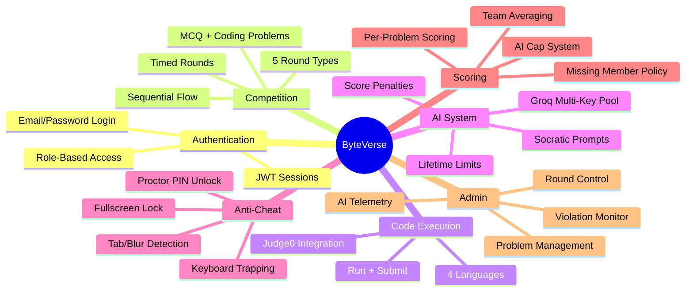

# 01 — Project Overview

**Purpose:** High-level description of the ByteVerse platform  
**Audience:** All Developers  
**Last Generated:** 2026-08-31  
**Source of Truth:** Repository implementation

---

## Project Purpose

ByteVerse is a full-stack competitive programming platform designed to host a multi-round, duo-based coding competition at VCET, Vasai. It replaces the need for multiple external tools (HackerRank, Google Forms, spreadsheets) with a single, integrated web application.

## Business Objective

Provide NSDC (the organizing body) with a platform that:
- Delivers competition problems in a controlled environment
- Executes and judges participant code in real time
- Offers AI-assisted tutoring with transparent scoring penalties
- Enforces academic integrity through anti-cheat mechanisms
- Generates live leaderboards for audience engagement
- Gives administrators full control over competition flow

## Problem Being Solved

College coding competitions typically require participants to:
1. Register on external platforms
2. Switch between code editors, judges, and communication channels
3. Self-report scores

ByteVerse eliminates this by providing an end-to-end experience from registration to final standings.

## Major Capabilities

| Capability | Status |
|------------|--------|
| Participant authentication (email/password) | ✅ Implemented |
| Team creation & invite codes | ✅ Implemented |
| Multi-round competition (5 round types) | ✅ Implemented |
| MCQ questions with auto-scoring | ✅ Implemented |
| Monaco Code Editor with 4 languages | ✅ Implemented |
| Judge0 code execution (self-hosted & RapidAPI) | ✅ Implemented |
| AI Socratic tutoring (Groq multi-key) | ✅ Implemented |
| AI score penalties (cap-based system) | ✅ Implemented |
| Anti-cheat (fullscreen, tab, blur, keyboard) | ✅ Implemented |
| Admin round control (start/pause/end) | ✅ Implemented |
| Live leaderboards (individual + team) | ✅ Implemented |
| Audit logging (violations, AI usage) | ✅ Implemented |
| Google/GitHub OAuth | ⬜ Configured but not active |
| WebSocket real-time updates | ⬜ Partial (Redis pub/sub + SSE attempted) |

## Scope

**In scope:** Registration, team management, 5 competition rounds, code execution, AI assistance, scoring, anti-cheat, admin controls, leaderboards.

**Out of scope:** Payment processing, video proctoring, mobile app, multi-event management beyond single ByteVerse instance.

## Non-Goals

- This is NOT a general-purpose online judge (like Codeforces)
- This is NOT a learning management system
- This is NOT designed for remote/unsupervised competitions

## Actors / Users

### Participant
- Registers with email/password
- Joins or creates a duo team
- Competes in sequential rounds
- Uses integrated code editor and AI assistant
- Views personal and team scores on leaderboard

### Admin / Super Admin
- Manages events, rounds, and problems
- Starts, pauses, and ends rounds
- Monitors participant violations in real time
- Views AI usage telemetry
- Manages teams and participants

### Organizer
- Has elevated permissions above Participant
- Can access admin features based on role hierarchy

## Participant Journey

```
Register → Create/Join Team → Wait for Round Start → 
Enter Fullscreen Arena → Solve Problems → 
(Optional) Use AI Assistant (score penalty) → 
Submit Solutions → View Results → 
Break → Next Round → ... → Final Leaderboard
```

## Admin Journey

```
Seed Database → Create Event → Configure Rounds → 
Add Problems → Start Round → Monitor Violations → 
Pause if needed → End Round → Review Scores → 
Start Next Round → ... → Publish Final Results
```

## High-Level Feature Map


