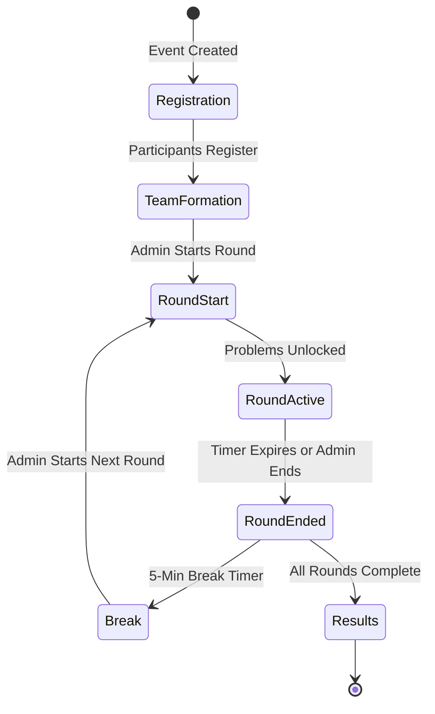

# 02 — Product and Event Context

**Purpose:** Explain the competition context separately from the software implementation  
**Audience:** All Developers / Organizers  
**Last Generated:** 2026-08-31  
**Source of Truth:** Repository implementation

---

## BYTEVERSE

ByteVerse is a duo-based technical coding competition organized as part of a college technical fest. The 2026 edition ("ByteVerse 2026") is the version this platform supports.

## NSDC

The organizing committee/body behind ByteVerse. Referenced throughout the codebase in seed data, UI copy, and anti-cheat lock screen messages.

## VCET, Vasai

Vidyavardhini's College of Engineering and Technology — the host institution. The competition is designed for an on-site environment with proctor-supervised workstations.

## Duo-Based Participation

- Teams consist of **exactly 2 participants**
- One member is designated as **Leader** (gets Set A problems)
- The other is a regular **Member** (gets Set B problems)
- Team scores are calculated as the **average** of both members' individual scores
- The `MissingMemberPolicy` enum controls how solo-member teams are scored:
  - `TREAT_AS_ZERO`: Missing member counts as 0 (default)
  - `MARK_INCOMPLETE`: Team score is 0 if either member missing
  - `TEAM_INELIGIBLE`: Same as MARK_INCOMPLETE
  - `REQUIRE_BOTH`: Both must submit for team to score

## Competition Lifecycle

## Challenge Categories

| Round | Type (Enum) | Seeded Name | Duration | Description |
|-------|-------------|-------------|----------|-------------|
| 1 | `CODE_LOGIC` | Logical Thinking | 20 min | MCQ-based logic tracing questions |
| 2 | `AI_REPAIR` | AI Code Optimization | 25 min | Optimize/fix AI-generated naive code |
| 3 | `TRADITIONAL` | Debugging & Code Analysis | 35 min | DSA-style problem solving |
| 4 | `TYPE_TRANSFORM` | Data Structures & Algorithms | 45 min | Multi-language translation/refactoring |
| 5 | `HUMAN_VS_MACHINE` | AI vs Human | 35 min | Grand finale competitive coding |

## Participant Expectations

- Compete on **supervised workstations** in an on-site lab
- Work within the platform's fullscreen mode
- No external tools, browsers, or communication devices
- AI assistance is available but incurs permanent score penalties
- Each team member works on their own problem set (Set A / Set B)

## Organizer Expectations

- Control round flow from the admin dashboard
- Monitor violations in real time
- Unlock workstations using the proctor PIN when violations are flagged
- Review AI usage and scoring at any time

## Product Requirement vs. Current Implementation

| Requirement | Implementation Status | Notes |
|-------------|----------------------|-------|
| Duo teams of exactly 2 | ✅ Schema supports it; UI enforces team join via invite code | No hard block on single-member teams competing |
| On-site proctored environment | ✅ Anti-cheat enforces fullscreen/tab/blur | Relies on client-side enforcement |
| Sequential round progression | ✅ Rounds have sequence numbers, UI shows next round | No automatic round advancement |
| Real-time leaderboard | ✅ Redis-cached, pub/sub invalidation | SSE stream endpoint attempted but may not be fully wired |
| Google/GitHub OAuth | ⬜ Env vars configured, no provider setup in auth.ts | Only Credentials provider is active |
