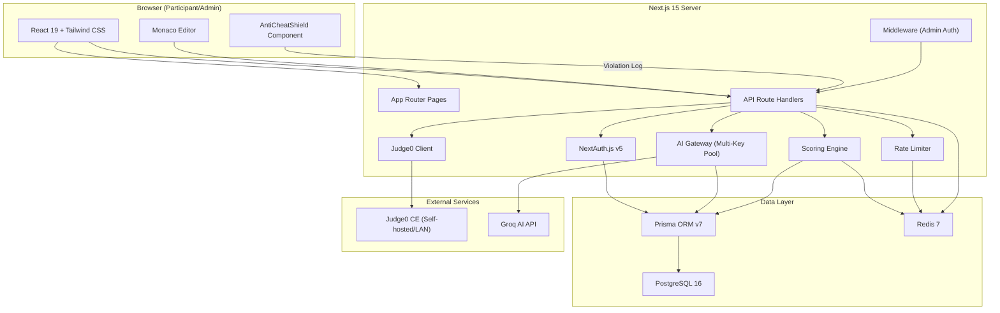
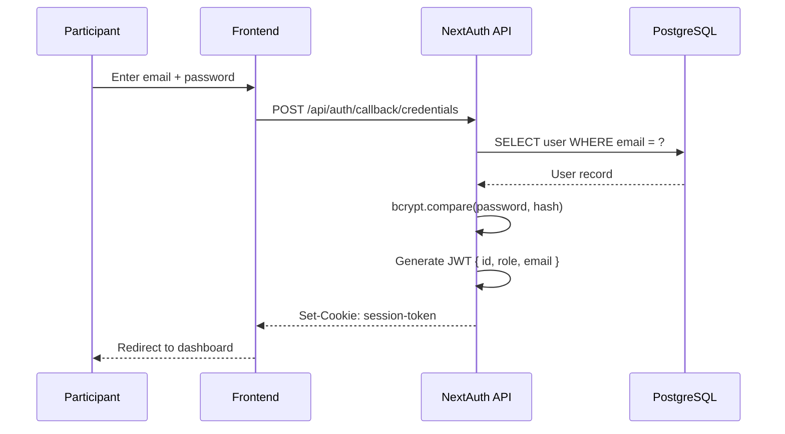
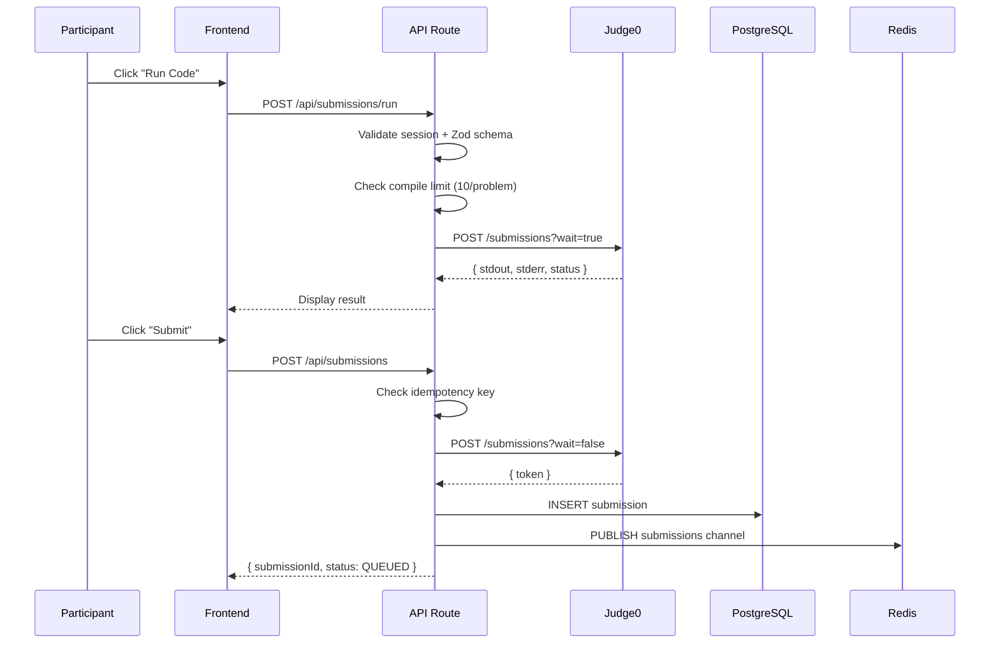
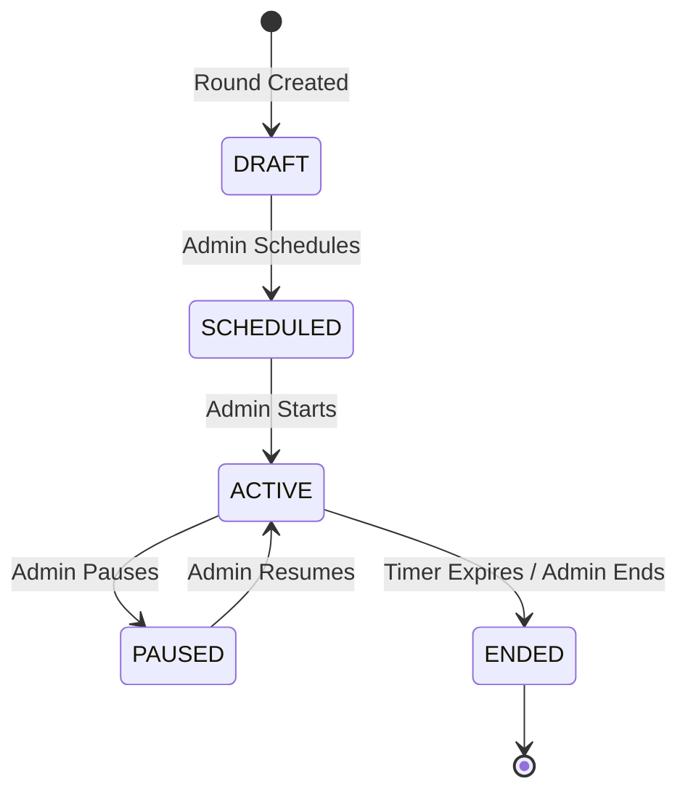

# 03 — Architecture

**Purpose:** Detailed system architecture with diagrams  
**Audience:** All Developers / AI Agents  
**Last Generated:** 2026-08-31  
**Source of Truth:** Repository implementation

---

## System Architecture

ByteVerse is a **Next.js 15 monolithic full-stack application**. The frontend (React 19) and backend (API Routes) coexist in a single codebase. External services include PostgreSQL, Redis, Judge0, and Groq AI.

## Frontend Architecture

- **Framework:** Next.js 15 App Router with React 19
- **Styling:** Tailwind CSS 3.4 + Radix UI primitives
- **Code Editor:** Monaco Editor (`@monaco-editor/react`)
- **Animations:** Framer Motion
- **State:** Zustand (store directory) + React `useState`/`useCallback`
- **Icons:** Lucide React
- **Route Groups:**
  - `(auth)` → Login page
  - `(admin)` → Admin dashboard (protected by middleware)
  - `(participant)` → Round workspace, leaderboard, team management

## Backend Architecture

- **Runtime:** Next.js API Routes (Node.js)
- **Authentication:** NextAuth.js v5 with JWT strategy + Credentials provider
- **ORM:** Prisma 7 with native `pg` driver adapter (`@prisma/adapter-pg`)
- **Validation:** Zod schemas on every API endpoint
- **Database:** PostgreSQL 16 (Docker, port 5433)
- **Cache/Pub-Sub:** Redis 7 via ioredis (leaderboard cache, rate limiting, admin alerts)
- **Code Execution:** Judge0 CE via HTTP (axios)
- **AI:** OpenAI SDK pointed at Groq API base URL

## Database

- **12 models** defined in `prisma/schema.prisma`
- Native PG driver via `@prisma/adapter-pg` (not Prisma's query engine)
- Connection pooling via `node-postgres` `Pool`
- See [10-DATABASE.md](./10-DATABASE.md) for full schema

## Code Execution

- **Judge0 CE v1.13.1** — runs participant code in isolated Docker containers
- Supports: C (50), C++ (54), Java (62), Python (71)
- Two modes:
  - **Run** (`/api/submissions/run`): Synchronous `wait=true`, returns stdout/stderr immediately
  - **Submit** (`/api/submissions`): Asynchronous `wait=false`, stores token for polling
- Configurable via `JUDGE0_URL` env var (LAN or RapidAPI)
- See [19-CODE-EXECUTION-SYSTEM.md](./19-CODE-EXECUTION-SYSTEM.md) for details

## AI Services

- **Provider:** Groq (OpenAI-compatible API)
- **Model:** `qwen/qwen3.8-27b` (configurable)
- **Architecture:** Multi-key round-robin pool (up to 15 keys)
- **Failover:** 429 detection → 60s cooldown → auto-switch to next key
- **Prompts:** Round-specific Socratic system prompts (never give answers)
- **Safety:** Input sanitization (anti-injection patterns), output stripping (code blocks > 2 lines)
- See [18-AI-SYSTEM.md](./18-AI-SYSTEM.md) for details

## Realtime Communication

- **Redis Pub/Sub channels:**
  - `leaderboard` — score update notifications
  - `submissions` — new submission alerts
  - `scores:{eventId}` — AI penalty broadcasts
  - `admin:alerts:{eventId}` — violation alerts for proctors
- **SSE:** `EventSource` attempted in round workspace (connecting to `/api/rounds/{id}/stream`)
- **Polling:** 6-second fallback polling for round state

## Authentication Flow

## Submission Lifecycle

## Competition State Machine

## Request Lifecycle

1. Browser makes `fetch()` to `/api/*` endpoint
2. Next.js middleware checks admin routes for session cookie
3. API route handler calls `auth()` to verify JWT session
4. Zod validates request body
5. Business logic executed (scoring, Judge0, AI, etc.)
6. Prisma queries PostgreSQL
7. Redis updated (cache invalidation, pub/sub)
8. JSON response returned

## Important Module Boundaries

| Module | Responsibility | Files |
|--------|---------------|-------|
| **Auth** | Session management, role checking | `src/lib/auth.ts`, `src/lib/rbac.ts`, `src/middleware.ts` |
| **AI Gateway** | Multi-key rotation, Socratic prompts, usage tracking | `src/lib/ai-gateway.ts` |
| **Judge** | Code execution via Judge0 | `src/lib/judge.ts`, `src/app/api/submissions/run/route.ts` |
| **Scoring** | Score calculation, AI penalties, team aggregation | `src/lib/scoring.ts` |
| **Anti-Cheat** | Client-side enforcement, violation logging | `src/components/participant/AntiCheatShield.tsx`, `src/app/api/audit/violation/route.ts` |
| **Data** | Prisma client, Redis wrapper | `src/lib/db.ts`, `src/lib/redis.ts` |
