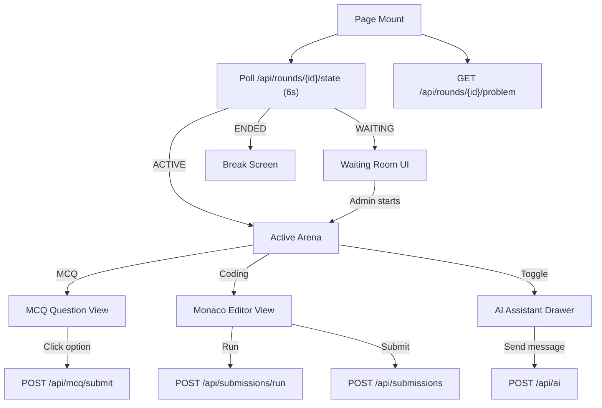

# 08 — Frontend Architecture

**Purpose:** Document the frontend application structure and patterns  
**Audience:** Frontend Developers / AI Agents  
**Last Generated:** 2026-08-31  
**Source of Truth:** Repository implementation

---

## Application Entry Point

- `src/app/layout.tsx` — Root layout with HTML structure, fonts, metadata
- `src/app/page.tsx` — Landing page with team registration + login split view

## Routing (Next.js App Router)

The app uses Next.js **Route Groups** to organize pages by user role:

| Route Group | URL Pattern | Purpose |
|-------------|------------|---------|
| `(auth)` | `/login` | Authentication page |
| `(admin)` | `/admin/*` | Admin dashboard (middleware-protected) |
| `(participant)` | `/rounds/*, /leaderboard, /team` | Participant features |

## Key Pages

| Page | File | Description |
|------|------|-------------|
| Landing / Registration | `src/app/page.tsx` | Split-view: team registration form + login |
| Login | `src/app/(auth)/login/page.tsx` | Email/password login form |
| Round Workspace | `src/app/(participant)/rounds/[roundId]/page.tsx` | **Main competition page** — 1165 lines, handles MCQ + coding |
| Leaderboard | `src/app/(participant)/leaderboard/page.tsx` | Public leaderboard |
| Team Management | `src/app/(participant)/team/page.tsx` | Join team via invite code |
| Admin Dashboard | `src/app/(admin)/admin/page.tsx` | Admin home with statistics |
| Admin Rounds | `src/app/(admin)/admin/rounds/page.tsx` | Round start/pause/end controls |
| Admin AI | `src/app/(admin)/admin/ai/page.tsx` | AI key telemetry dashboard |

## Key Components

### Participant Components

| Component | File | Purpose |
|-----------|------|---------|
| `AntiCheatShield` | `src/components/participant/AntiCheatShield.tsx` | Fullscreen, tab, blur, keyboard enforcement with proctor PIN unlock |
| `AIAssistantDrawer` | `src/components/participant/AIAssistantDrawer.tsx` | Slide-out AI chat panel with EXPLAIN/CODE tabs |
| `SystemReadinessGate` | `src/components/participant/SystemReadinessGate.tsx` | Pre-round checklist and agreement gate |

### Admin Components

| Component | File | Purpose |
|-----------|------|---------|
| `AdminNavbar` | `src/components/admin/AdminNavbar.tsx` | Admin navigation sidebar |

### UI Primitives (`src/components/ui/`)

Radix UI-based components with `class-variance-authority`:
- Button, Dialog, AlertDialog, Toast, Tooltip
- Avatar, Dropdown Menu, Label, Progress
- Select, Separator, Tabs, Slot

## State Management

- **Zustand** store in `src/store/` (minimal usage; most state is component-local)
- **React `useState`** for most component state
- **`useCallback`/`useRef`** for stable callbacks in event listeners

## API Communication Pattern

All API calls use native `fetch()`:

```typescript
// Typical pattern in components
const res = await fetch("/api/endpoint", {
  method: "POST",
  headers: { "Content-Type": "application/json" },
  body: JSON.stringify(payload),
});
const data = await res.json();
```

No centralized API client or React Query — raw fetch with inline error handling.

## Competition UI Flow

```
User Action → Component State → fetch() to API → JSON Response → State Update → Re-render
```

### MCQ Round (CODE_LOGIC)

1. Problems loaded via `/api/rounds/{id}/problem`
2. Rendered as question cards with 4 options (A/B/C/D)
3. Option click → `handleSelectOption()` → `POST /api/mcq/submit`
4. Question palette shows answered/unanswered state
5. Navigation: Previous/Next buttons + direct palette click

### Coding Round (AI_REPAIR, TRADITIONAL, etc.)

1. Problems loaded with starter codes
2. Monaco Editor rendered with language selector
3. "Run" button → `POST /api/submissions/run` → output displayed
4. "Submit" button → `POST /api/submissions` → verdict displayed
5. Reset button restores original starter code

## Timer Implementation

- Server sends `timeLeftSeconds` via `/api/rounds/{id}/state`
- Client-side `setInterval` counts down every 1 second
- 6-second polling syncs timer with server
- When `timeLeft <= 0`, round shows "Break" screen
- Break screen has its own 5-minute countdown (client-only)
- Timer text turns red when < 5 minutes remaining

## Anti-Cheat Browser Logic

See [20-ANTI-CHEAT-SYSTEM.md](./20-ANTI-CHEAT-SYSTEM.md) for full details. The `AntiCheatShield` component:
- Monitors `visibilitychange`, `blur`, `focus` events
- Polls fullscreen state every 100ms
- Blocks keyboard shortcuts (F12, Ctrl+T, Ctrl+R, PrintScreen, etc.)
- Locks screen on violation → requires proctor PIN to unlock
- 4-second grace period after unlock to prevent re-trigger

## Code Editor Configuration

- **Monaco Editor** loaded dynamically (`next/dynamic` with `ssr: false`)
- 4 languages: C, C++, Java, Python
- Default starter code per language (`LANG_DEFAULTS` constant)
- Per-problem starter codes loaded from database (`starterCodes` JSON field)
- Code state tracked per-problem per-language in `codeMap` state

## Data Flow Diagrams

### Round Workspace Data Flow


