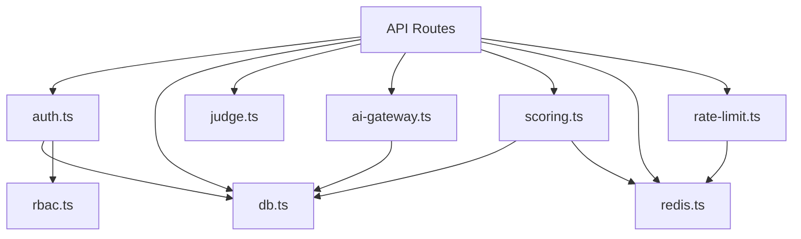

# 09 — Backend Architecture

**Purpose:** Document the backend API structure and business logic  
**Audience:** Backend Developers / AI Agents  
**Last Generated:** 2026-08-31  
**Source of Truth:** Repository implementation

---

## Application Bootstrap

Next.js API routes auto-initialize on first request. Key singletons:
- `src/lib/db.ts` — PrismaClient with native PG adapter (cached in `globalThis`)
- `src/lib/redis.ts` — ioredis client (lazy-connected)
- `src/lib/ai-gateway.ts` — Key pool initialized at module load time

## Route Structure

All API handlers follow the Next.js App Router convention: `src/app/api/{path}/route.ts` exporting named functions (`GET`, `POST`, `PUT`, `DELETE`).

### Public API Routes

| Route | Methods | Purpose |
|-------|---------|---------|
| `/api/auth/[...nextauth]` | GET, POST | NextAuth handler |
| `/api/auth/register` | POST | User registration |
| `/api/health` | GET | Health check |

### Participant API Routes

| Route | Methods | Purpose | Auth |
|-------|---------|---------|------|
| `/api/teams` | POST, DELETE | Create team, leave team | Yes |
| `/api/teams/join` | POST | Join team via invite code | Yes |
| `/api/rounds/current` | GET | List all rounds for navigation | Yes |
| `/api/rounds/[roundId]/state` | GET | Get round phase + timer | Yes |
| `/api/rounds/[roundId]/problem` | GET | Get problems for round | Yes |
| `/api/submissions` | POST | Submit code solution | Yes |
| `/api/submissions/run` | POST | Run code (synchronous) | Yes |
| `/api/submissions/[id]` | GET | Get submission result | Yes |
| `/api/mcq/submit` | POST | Submit MCQ answer | Yes |
| `/api/ai` | GET, POST | AI assistant (usage + chat) | Yes |
| `/api/audit/violation` | POST, PUT | Log violation / Unlock PIN | Yes* |
| `/api/leaderboard` | GET | Redirect to individual leaderboard | No |

### Admin API Routes

| Route | Methods | Purpose | Roles |
|-------|---------|---------|-------|
| `/api/admin/rounds` | GET, POST | List/create rounds | ORGANIZER+ |
| `/api/admin/rounds/[id]` | GET, PUT, DELETE | Manage specific round | ORGANIZER+ |
| `/api/admin/rounds/[id]/status` | PUT | Start/pause/end round | ORGANIZER+ |
| `/api/admin/problems` | GET, POST | List/create problems | ORGANIZER+ |
| `/api/admin/teams` | GET | List all teams | ORGANIZER+ |
| `/api/admin/participants` | GET | List all participants | ORGANIZER+ |
| `/api/admin/events` | GET, PUT | Manage event | ADMIN+ |
| `/api/admin/announcements` | GET, POST | Manage announcements | ORGANIZER+ |
| `/api/admin/ai` | GET | AI key telemetry | ADMIN+ |
| `/api/admin/stats` | GET | Dashboard statistics | ORGANIZER+ |

## Middleware

`src/middleware.ts` — Protects `/admin/*` routes by checking for session cookies:
- Checks `__Secure-authjs.session-token`, `authjs.session-token`, `next-auth.session-token`
- Redirects to `/login?callbackUrl=...` if no cookie found
- Does NOT verify JWT — only checks cookie existence

## Authentication Pattern

Every API route that requires auth follows this pattern:

```typescript
const session = await auth();
if (!session?.user?.id) {
  return NextResponse.json({ error: "Unauthorized" }, { status: 401 });
}
```

## Validation Pattern

Every API route validates input with Zod:

```typescript
const schema = z.object({
  field: z.string().min(1).max(100),
});
const parsed = schema.safeParse(body);
if (!parsed.success) {
  return NextResponse.json({ error: parsed.error.flatten() }, { status: 422 });
}
```

## Services / Business Logic

| Module | File | Responsibility |
|--------|------|----------------|
| **AI Gateway** | `src/lib/ai-gateway.ts` | Multi-key rotation, Socratic prompts, lifetime limits, telemetry |
| **Scoring** | `src/lib/scoring.ts` | `updateRoundScore()`, `applyAIPenalty()`, `calculateTeamScore()` |
| **Judge** | `src/lib/judge.ts` | `submitToJudge()`, `getJudgeResult()`, `mapJudgeStatus()` |
| **Auth** | `src/lib/auth.ts` | NextAuth config, `signIn`, `signOut`, `auth()` |
| **RBAC** | `src/lib/rbac.ts` | `requireRole()` hierarchy check |
| **Rate Limit** | `src/lib/rate-limit.ts` | Redis-backed `checkRateLimit()` |
| **Redis** | `src/lib/redis.ts` | Cache wrapper with graceful fallbacks |
| **Database** | `src/lib/db.ts` | Prisma client singleton |

## Error Handling Pattern

API routes use try/catch blocks with typed error responses:

```typescript
try {
  // business logic
} catch (err: unknown) {
  const errMsg = err instanceof Error ? err.message : String(err);
  return NextResponse.json({ error: errMsg }, { status: 500 });
}
```

## Dependency Graph


