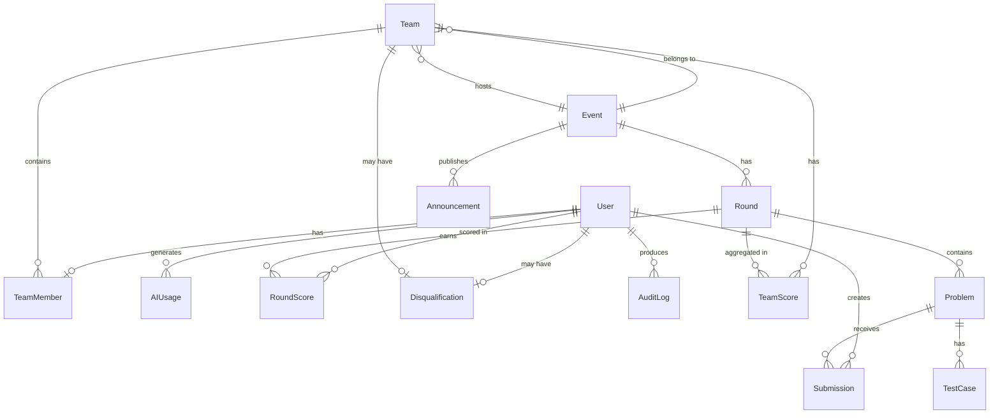

# 10 — Database

**Purpose:** Document all database models, relationships, and constraints  
**Audience:** All Developers / AI Agents  
**Last Generated:** 2026-08-31  
**Source of Truth:** `prisma/schema.prisma`

---

## Overview

- **Database:** PostgreSQL 16
- **ORM:** Prisma 7 with native `@prisma/adapter-pg` driver
- **Schema file:** `prisma/schema.prisma`
- **12 models, 6 enums**
- All table names use `snake_case` via `@@map()`

## ER Diagram

## Enums

| Enum | Values |
|------|--------|
| `Role` | `PARTICIPANT`, `ORGANIZER`, `ADMIN`, `SUPER_ADMIN` |
| `TeamStatus` | `PENDING`, `ACTIVE`, `LOCKED`, `DISQUALIFIED` |
| `RoundType` | `CODE_LOGIC`, `AI_REPAIR`, `TRADITIONAL`, `TYPE_TRANSFORM`, `HUMAN_VS_MACHINE` |
| `RoundStatus` | `DRAFT`, `SCHEDULED`, `ACTIVE`, `PAUSED`, `ENDED` |
| `SubmissionStatus` | `QUEUED`, `RUNNING`, `ACCEPTED`, `WRONG_ANSWER`, `TIME_LIMIT_EXCEEDED`, `MEMORY_LIMIT_EXCEEDED`, `COMPILATION_ERROR`, `RUNTIME_ERROR`, `SYSTEM_ERROR` |
| `AIType` | `EXPLAIN`, `CODE` |
| `MissingMemberPolicy` | `TREAT_AS_ZERO`, `MARK_INCOMPLETE`, `TEAM_INELIGIBLE`, `REQUIRE_BOTH` |

## Models

### User (`users`)

| Field | Type | Notes |
|-------|------|-------|
| `id` | String (cuid) | Primary key |
| `email` | String | Unique, indexed |
| `name` | String? | Display name |
| `college` | String? | Default: "NSDC College" |
| `passwordHash` | String? | bcrypt hash |
| `role` | Role | Default: PARTICIPANT |
| `createdAt` | DateTime | Auto |
| `updatedAt` | DateTime | Auto |

**Relations:** TeamMember (1:1), Submissions (1:N), AIUsages (1:N), RoundScores (1:N), Disqualification (1:1), AuditLogs (1:N)

### Team (`teams`)

| Field | Type | Notes |
|-------|------|-------|
| `id` | String (cuid) | Primary key |
| `name` | String | Unique team name |
| `inviteCode` | String | Unique, auto-generated cuid |
| `status` | TeamStatus | Default: PENDING |
| `isLocked` | Boolean | Anti-cheat lock flag |
| `eventId` | String | FK to Event |

**Relations:** Event (N:1), TeamMembers (1:N), TeamScores (1:N), Disqualification (1:1)

### TeamMember (`team_members`)

| Field | Type | Notes |
|-------|------|-------|
| `id` | String (cuid) | Primary key |
| `teamId` | String | FK to Team (cascade delete) |
| `userId` | String | FK to User (unique — one team per user) |
| `isLeader` | Boolean | Determines Set A vs Set B |
| `joinedAt` | DateTime | Auto |

### Event (`events`)

| Field | Type | Notes |
|-------|------|-------|
| `id` | String (cuid) | Primary key |
| `name` | String | Event name |
| `description` | String? | Description |
| `startsAt` | DateTime? | Scheduled start |
| `endsAt` | DateTime? | Scheduled end |
| `registrationOpen` | Boolean | Team creation allowed |
| `teamRegistrationOpen` | Boolean | Team joining allowed |
| `isActive` | Boolean | Currently active event |
| `missingMemberPolicy` | MissingMemberPolicy | How to handle solo teams |

### Round (`rounds`)

| Field | Type | Notes |
|-------|------|-------|
| `id` | String (cuid) | Primary key |
| `eventId` | String | FK to Event |
| `name` | String | Display name |
| `type` | RoundType | Challenge type |
| `status` | RoundStatus | Default: DRAFT |
| `sequence` | Int | Round order (unique per event) |
| `durationMin` | Int | Duration in minutes |
| `startsAt` | DateTime? | Server-set when admin starts |
| `endsAt` | DateTime? | Server-computed from startsAt + duration |
| `maxScore` | Int | Maximum possible score |
| `aiExplainPenalty` | Int | Score cap when EXPLAIN used (default: 75) |
| `aiCodePenalty` | Int | Score cap when CODE used (default: 50) |

**Unique constraint:** `[eventId, sequence]`

### Problem (`problems`)

| Field | Type | Notes |
|-------|------|-------|
| `id` | String (cuid) | Primary key |
| `roundId` | String | FK to Round |
| `title` | String | Problem title |
| `statement` | String | Problem description (text or code) |
| `inputFormat` | String? | Expected input format |
| `outputFormat` | String? | Expected output format |
| `constraints` | String? | Problem constraints |
| `sampleInput` | String? | Sample stdin |
| `sampleOutput` | String? | Sample expected output |
| `difficulty` | String? | Difficulty label |
| `timeLimitMs` | Int | Default: 2000 |
| `memoryLimitMb` | Int | Default: 256 |
| `allowedLangs` | String[] | Default: ["cpp","c","java","python"] |
| `isPublished` | Boolean | Visibility flag |
| `set` | String | "A" or "B" (leader vs member) |
| `starterCodes` | Json? | `{ "c": "...", "cpp": "...", ... }` |
| `options` | Json? | MCQ options `{ "c": { "A": "...", "B": "..." } }` |
| `correctOption` | String? | Correct MCQ answer ("A"/"B"/"C"/"D") |
| `sequence` | Int | Display order |

### TestCase (`test_cases`)

| Field | Type | Notes |
|-------|------|-------|
| `id` | String (cuid) | Primary key |
| `problemId` | String | FK to Problem (cascade delete) |
| `input` | String | Test input |
| `expected` | String | Expected output |
| `isHidden` | Boolean | Hidden from participants |
| `score` | Int | Points for this test case |
| `sequence` | Int | Order |

### Submission (`submissions`)

| Field | Type | Notes |
|-------|------|-------|
| `id` | String (cuid) | Primary key |
| `userId` | String | FK to User |
| `problemId` | String | FK to Problem |
| `roundId` | String | Denormalized round reference |
| `language` | String | "cpp", "c", "java", "python", or "mcq" |
| `sourceCode` | String | Submitted code or "Option Selected: X" |
| `status` | SubmissionStatus | Default: QUEUED |
| `rawScore` | Float | Score before AI cap |
| `finalScore` | Float | `min(rawScore, aiScoreCap)` |
| `aiScoreCap` | Int | Max score allowed (default: 100) |
| `executionTimeMs` | Int? | Execution time |
| `memoryUsedMb` | Float? | Memory used |
| `judgeToken` | String? | Judge0 submission token |
| `idempotencyKey` | String | Unique, prevents duplicate submissions |

### AIUsage (`ai_usages`)

| Field | Type | Notes |
|-------|------|-------|
| `userId` | String | FK to User |
| `roundId` | String | Which round |
| `type` | AIType | EXPLAIN or CODE |
| `prompt` | String | Sanitized user prompt |
| `response` | String? | AI response (truncated to 2000 chars) |
| `tokensUsed` | Int? | Token count |

### RoundScore (`round_scores`)

| Field | Type | Notes |
|-------|------|-------|
| `userId` | String | FK to User |
| `roundId` | String | FK to Round |
| `rawScore` | Float | Score before AI cap |
| `finalScore` | Float | `min(rawScore, aiScoreCap)` |
| `aiScoreCap` | Int | Reduced by AI usage (default: 100) |
| `explainUsed` | Boolean | Has used EXPLAIN |
| `codeUsed` | Boolean | Has used CODE |

**Unique constraint:** `[userId, roundId]`

### TeamScore (`team_scores`)

| Field | Type | Notes |
|-------|------|-------|
| `teamId` | String | FK to Team |
| `roundId` | String | FK to Round |
| `member1Score` | Float | Leader's score |
| `member2Score` | Float? | Member's score (null if missing) |
| `avgScore` | Float | `(member1 + member2) / 2` |

**Unique constraint:** `[teamId, roundId]`

### Disqualification (`disqualifications`)

| Field | Type | Notes |
|-------|------|-------|
| `userId` | String? | Unique, FK to User |
| `teamId` | String? | Unique, FK to Team |
| `reason` | String | Disqualification reason |
| `disqualifiedBy` | String | Admin who disqualified |

### Announcement (`announcements`)

| Field | Type | Notes |
|-------|------|-------|
| `eventId` | String | FK to Event |
| `title` | String | Announcement title |
| `body` | String | Content |
| `isPinned` | Boolean | Sticky announcement |

### AuditLog (`audit_logs`)

| Field | Type | Notes |
|-------|------|-------|
| `userId` | String | FK to User |
| `action` | String | e.g., "INTEGRITY_VIOLATION" |
| `target` | String? | Team ID or user ID |
| `metadata` | Json? | Additional context |
| `ip` | String? | Client IP address |

## Data Integrity

- `TeamMember.userId` is unique → one team per user
- `Submission.idempotencyKey` is unique → prevents duplicate submissions
- `Round.[eventId, sequence]` is unique → no duplicate round numbers
- `RoundScore.[userId, roundId]` is unique → one score per user per round
- `TeamScore.[teamId, roundId]` is unique → one team score per round
- Cascade deletes on: TeamMember (from Team), TeamMember (from User), TestCase (from Problem)
