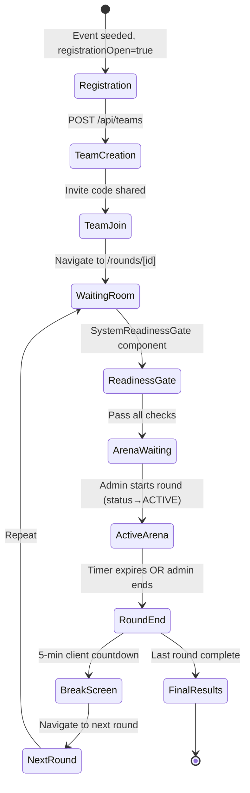

# 13 — Competition Flow

**Purpose:** Document the complete competition lifecycle  
**Audience:** All Developers / Organizers  
**Last Generated:** 2026-08-31  
**Source of Truth:** Repository implementation

---

## Competition Lifecycle

## Who Changes Competition State?

Only **Admins/Organizers** can change round status via `PUT /api/admin/rounds/[id]/status`. The frontend polls `/api/rounds/[id]/state` every 6 seconds and auto-transitions UI accordingly.

## How Participants Receive State

1. **Polling:** `GET /api/rounds/[id]/state` every 6 seconds
2. **SSE (attempted):** `EventSource` connecting to `/api/rounds/[id]/stream`
3. **Response includes:** phase, timeLeftSeconds, round metadata, team info

## Timer Management

- **Server-authoritative:** `startsAt` and `endsAt` set on Round model when admin starts
- **Client display:** `timeLeftSeconds` sent by server, client counts down via `setInterval(1000)`
- **Auto-end:** State API auto-transitions ACTIVE→ENDED when `now >= endsAt`

## Failure Cases

| Scenario | Behavior |
|----------|----------|
| Server crash during round | Timer continues based on stored `endsAt`; state recoverable |
| Network disconnect | Polling fails silently; anti-cheat may trigger on blur |
| Browser refresh blocked | Ctrl+R trapped by AntiCheatShield |
| All AI keys exhausted | Error returned; participant continues without AI |
