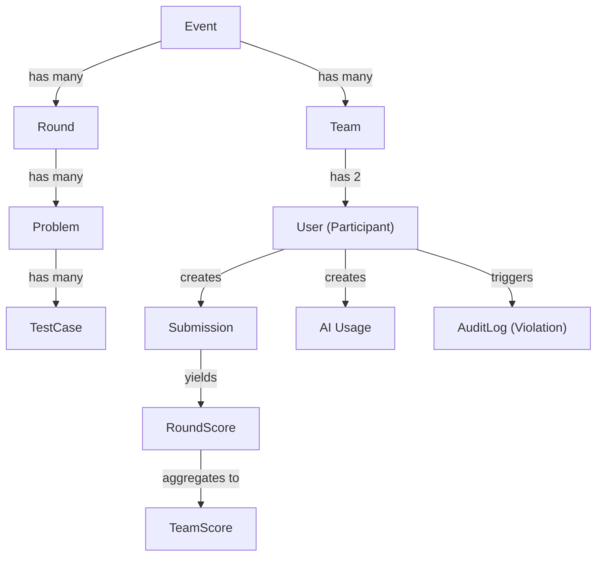

# 14 — Domain Model

**Purpose:** Explain business concepts independently from database tables  
**Audience:** All Developers / AI Agents  
**Last Generated:** 2026-08-31  
**Source of Truth:** Repository implementation

---

## Core Concepts

### Competition / Event
The top-level container. One Event = one ByteVerse edition. Controls registration windows and missing member policy.
- **Files:** `prisma/schema.prisma` (Event model), `prisma/seed.ts`

### Team
A duo of exactly two participants. Has a unique invite code for the second member to join. Can be PENDING → ACTIVE → LOCKED → DISQUALIFIED.
- **Invariant:** One user can belong to at most one team (`TeamMember.userId` is unique)
- **Files:** `src/app/api/teams/route.ts`

### Participant (User)
A registered user with email/password credentials. Has a role (PARTICIPANT/ORGANIZER/ADMIN/SUPER_ADMIN).
- **Files:** `src/lib/auth.ts`, `prisma/schema.prisma` (User model)

### Round
A timed competition phase with a specific challenge type. Rounds progress sequentially (sequence 1→5). Each round has its own AI penalty configuration.
- **States:** DRAFT → SCHEDULED → ACTIVE → PAUSED → ENDED
- **Files:** `prisma/schema.prisma` (Round model), `prisma/seed.ts`

### Problem / Challenge
A question within a round. Can be MCQ (with options + correctOption) or coding (with starterCodes + testCases). Problems are assigned to Set A or Set B.
- **Files:** `prisma/schema.prisma` (Problem model), `scripts/seed-round*-questions.ts`

### Submission
A participant's answer to a problem. For MCQ: stores "Option Selected: X". For coding: stores source code. Has a Judge0 token for async evaluation.
- **Invariant:** `idempotencyKey` prevents duplicate submissions
- **Files:** `src/app/api/submissions/route.ts`, `src/app/api/mcq/submit/route.ts`

### AI Request (AIUsage)
A logged interaction with the Socratic AI tutor. Types: EXPLAIN (conceptual) or CODE (syntax/pattern). Each usage permanently reduces the user's score cap.
- **Lifetime limits:** 15 EXPLAIN, 25 CODE across entire tournament
- **Files:** `src/lib/ai-gateway.ts`, `src/app/api/ai/route.ts`

### Score (RoundScore / TeamScore)
Individual score = `min(rawScore, aiScoreCap)`. Team score = average of both members' finalScores. Missing member handling configurable via event policy.
- **Files:** `src/lib/scoring.ts`

### Violation (AuditLog)
A logged anti-cheat event (tab switch, blur, fullscreen exit, etc.). Stored in AuditLog with metadata. Published to Redis for live proctor alerts.
- **Files:** `src/components/participant/AntiCheatShield.tsx`, `src/app/api/audit/violation/route.ts`

### Competition State
The current phase of a round (DRAFT/SCHEDULED/ACTIVE/PAUSED/ENDED). Server is the source of truth. Client polls every 6 seconds.
- **Files:** `src/app/api/rounds/[roundId]/state/route.ts`

## Concept Relationships

## Critical Invariants

1. **A team must contain exactly two participants** (enforced by invite code flow, but schema allows 1)
2. **One user = one team** (`TeamMember.userId` is unique)
3. **Server determines competition state** (client is display-only)
4. **`finalScore = min(rawScore, aiScoreCap)`** — AI penalty is a ceiling, not subtraction
5. **AI penalties are permanent per round** — once EXPLAIN is used, cap drops to 75 and stays
6. **Completed submissions are immutable** after judging
7. **Round sequence must be unique per event** (database constraint)
