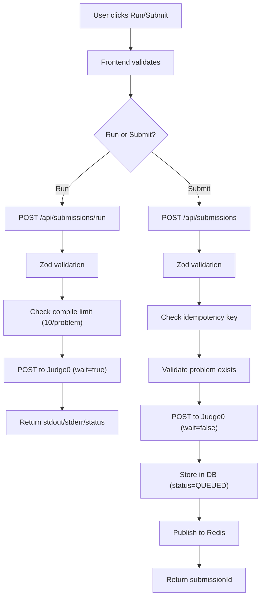

# 16 — Submission System

**Purpose:** Trace a submission from user action to final result  
**Audience:** All Developers  
**Last Generated:** 2026-08-31  
**Source of Truth:** Repository implementation

---

## Submission Pipeline

## Run (Synchronous Execution)

- **Endpoint:** `POST /api/submissions/run`
- **Source:** `src/app/api/submissions/run/route.ts`
- **Judge0 mode:** `wait=true` (blocks until execution completes)
- **Timeout:** 12 seconds (axios timeout)
- **CPU limit:** 2.0 seconds
- **Memory limit:** 256 MB
- **Rate limit:** 10 runs per user per problem (in-memory Map, resets on server restart)
- **NOT stored in database** — only returns output for testing

## Submit (Asynchronous Judging)

- **Endpoint:** `POST /api/submissions`
- **Source:** `src/app/api/submissions/route.ts`
- **Judge0 mode:** `wait=false` (returns token immediately)
- **Idempotency:** UUID `idempotencyKey` prevents duplicate submissions
- **Stored in database** with Judge0 token for result polling
- **Published to Redis** `submissions` channel

## MCQ Submit

- **Endpoint:** `POST /api/mcq/submit`
- **Source:** `src/app/api/mcq/submit/route.ts`
- **Auto-scored:** Compares `selectedOption` with `problem.correctOption`
- **Score:** 10 points if correct, 0 if wrong
- **Upsert:** Creates or updates existing submission for same problem
- **Recalculates** total round score from all MCQ submissions

## Allowed Languages

| Language | Judge0 ID | Source |
|----------|-----------|--------|
| C | 50 | `src/lib/judge.ts`, `src/app/api/submissions/run/route.ts` |
| C++ | 54 | Same |
| Java | 62 | Same |
| Python | 71 | Same |

## Result States

| Status | Judge0 ID | Description |
|--------|-----------|-------------|
| QUEUED | 1 | Waiting in queue |
| RUNNING | 2 | Currently executing |
| ACCEPTED | 3 | Correct output |
| WRONG_ANSWER | 4 | Output mismatch |
| TIME_LIMIT_EXCEEDED | 5 | Exceeded CPU time |
| COMPILATION_ERROR | 6 | Failed to compile |
| RUNTIME_ERROR | 7-11, 13-14 | Various runtime failures |
| MEMORY_LIMIT_EXCEEDED | 12 | Exceeded memory limit |
| SYSTEM_ERROR | Other | Judge0 or network error |

## Code Storage

- Source code stored verbatim in `submission.sourceCode` (max 65536 chars)
- MCQ submissions stored as `"Option Selected: A"` string
- No encryption or obfuscation of stored code

## Compile Run Tracking

- In-memory `Map<string, number>` keyed by `{userId}:{problemId}`
- **Resets on server restart** (not persistent)
- Max 10 runs per user per problem
- Returns `runsUsed` and `runsLeft` in response
