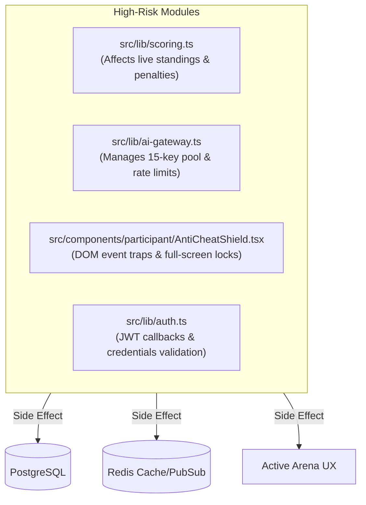

# 44 — AI Agent Guidelines

**Purpose:** Specific operating instructions, cognitive constraints, and behavioral rules for AI coding agents working on ByteVerse  
**Audience:** AI Coding Agents (Codex, Claude Code, Gemini CLI, Cursor, Copilot, Antigravity)  
**Last Generated:** 2026-08-31  
**Source of Truth:** Repository implementation & architecture

---

## 1. Primary Directives for AI Agents

When modifying or extending this codebase, you MUST adhere to the following core rules:

1. **Do Not Break Competition Invariants:**
   - Duo teams must always consist of at most 2 members (1 Leader + 1 Member).
   - Score formulas must strictly respect `finalScore = Math.min(rawScore, aiScoreCap)`.
   - Never remove or bypass the Zod validation schemas on API routes.
   - Never make the client the authority on competition timers or round transitions.

2. **Database & ORM Invariants:**
   - Do NOT run `prisma migrate dev` without testing against PostgreSQL 16.
   - Note that `src/lib/db.ts` uses `@prisma/adapter-pg` with a `pg.Pool` instance, NOT standard Prisma binary query engines. Do not remove or alter this driver adapter initialization.
   - Every database modification must be reflected in `prisma/schema.prisma`.
   - Never write raw unparameterized SQL queries.

3. **Multi-Key AI Gateway Invariants:**
   - Key rotation in `src/lib/ai-gateway.ts` manages up to 15 Groq API keys with in-memory telemetry, cooldown states, and cursor positions.
   - Do not remove the anti-injection filters or the long code-block stripping mechanism.
   - Respect lifetime tournament limits: 15 EXPLAIN prompts and 25 CODE prompts per user across the tournament.

4. **Judge0 Sandboxing Invariants:**
   - In `src/lib/judge.ts` and `src/app/api/submissions/run/route.ts`, the base URL must always be sanitized (stripping trailing slashes, `/system_info`, `/about`).
   - Language IDs are fixed integers: C (50), C++ (54), Java (62), Python (71). Do not alter these constants.

5. **Anti-Cheat & Security Invariants:**
   - Maintain client-side event trapping in `src/components/participant/AntiCheatShield.tsx`.
   - Keep the 4-second grace period after PIN unlocks to prevent immediate re-locking due to DOM transitions.
   - Always ensure anti-cheat violations trigger both an `AuditLog` database write and a Redis pub/sub broadcast.

---

## 2. Where to Locate Existing Patterns

| To Implement / Change... | Look At Reference Implementation |
|--------------------------|----------------------------------|
| New API Endpoint | `src/app/api/submissions/run/route.ts` (handles auth, Zod parsing, error mapping) |
| New Database Model | `prisma/schema.prisma` & `prisma/seed.ts` |
| Frontend Interactive Page | `src/app/(participant)/rounds/[roundId]/page.tsx` |
| Admin Control Feature | `src/app/(admin)/admin/rounds/page.tsx` & `src/app/api/admin/rounds/route.ts` |
| Real-time Event Broadcaster | `src/lib/redis.ts` & `src/lib/scoring.ts` |
| UI Component Styling | `src/components/ui/Button.tsx` (Tailwind + Radix UI + CVA) |

---

## 3. High-Risk Code Areas (Proceed with Extreme Caution)

---

## 4. Verification Checklist Before Finishing Any Task

- [ ] **Type Safety:** Run `npm run type-check` to confirm zero TypeScript compilation errors.
- [ ] **Linting:** Run `npm run lint` to verify ESLint compliance.
- [ ] **Data Model Consistency:** If `schema.prisma` changed, ensure `npm run db:generate` is executed.
- [ ] **Route Authentication:** Ensure all new non-public API routes call `await auth()` and verify `session?.user?.id`.
- [ ] **Response Format:** Ensure API errors return `{ error: string }` with accurate HTTP status codes (400, 401, 403, 404, 422, 429, 503).
