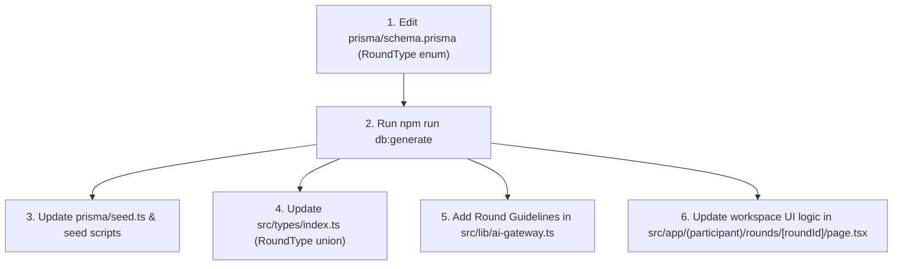

# 45 — Change Impact Map

**Purpose:** Matrix detailing what breaks across the platform when specific components or files are modified  
**Audience:** All Developers / AI Agents  
**Last Generated:** 2026-08-31  
**Source of Truth:** Full codebase dependency graph

---

## 1. Subsystem Dependency & Impact Matrix

| If You Modify... | Direct File Dependencies | Downstream System Impact | Potential Breakage & Side Effects |
|------------------|--------------------------|--------------------------|-----------------------------------|
| `prisma/schema.prisma` | `src/lib/db.ts`, all API routes, `seed.ts` | Database Layer, Queries, Types | Schema mismatch, query run-time errors if `db:generate` not run, broken relations in cascading operations. |
| `src/lib/auth.ts` | `src/middleware.ts`, all `route.ts` calling `auth()` | Authentication & Authorization | Broken session tokens, unauthorized 401 errors, loss of user role mapping in frontend components. |
| `src/lib/scoring.ts` | `src/app/api/submissions/*`, `src/app/api/ai/route.ts`, `src/app/api/mcq/submit/route.ts` | Leaderboards, Team Scores | Corrupted `finalScore`, missing AI penalties, stale Redis leaderboard caches, incorrect team averages. |
| `src/lib/ai-gateway.ts` | `src/app/api/ai/route.ts`, `src/app/(admin)/admin/ai/page.tsx` | Socratic AI Tutor, AI Admin Telemetry | 429 rate limit cascades, LLM returning raw code solutions, prompt injection vulnerabilities, broken telemetry cards. |
| `src/lib/judge.ts` | `src/app/api/submissions/route.ts`, `src/app/api/submissions/run/route.ts` | Code Execution Sandbox | 403/503 errors communicating with Judge0, unmapped execution statuses, hangs on synchronous wait calls. |
| `src/components/participant/AntiCheatShield.tsx` | `src/app/(participant)/rounds/[roundId]/page.tsx` | Live Competition UX, Proctor Station | Workstation permanent lock loops, failed keyboard intercept, false positive violation spikes in audit logs. |
| `src/lib/redis.ts` | `src/lib/rate-limit.ts`, `src/lib/scoring.ts`, `src/app/api/audit/violation/route.ts` | Caching, Pub/Sub, Live Proctor Alerts | Stale leaderboard UI, silence in proctor alert stream, rate limiting falling back to deny-all. |
| `src/app/api/rounds/[roundId]/state/route.ts` | `src/app/(participant)/rounds/[roundId]/page.tsx`, Admin Round Controls | Round Lifecycle & Timing | Clients unable to enter arena, timer freezing, active rounds failing to auto-transition to ENDED. |

---

## 2. Detailed Change Scenarios

### Scenario A: Adding a new Round Type to `RoundType` Enum

### Scenario B: Changing AI Penalty Rates
1. **Database:** Update default `aiExplainPenalty` and `aiCodePenalty` fields in `Round` model in `prisma/schema.prisma`.
2. **Scoring Engine:** Modify `applyAIPenalty()` in `src/lib/scoring.ts`.
3. **UI Display:** Update penalty badges in `src/components/participant/AIAssistantDrawer.tsx` and `SystemReadinessGate.tsx`.
4. **Leaderboard:** Invalidate Redis cache keys (`lb:individual:*`, `lb:team:*`).

### Scenario C: Modifying Judge0 Languages or Limits
1. **Constants:** Update `LANG_IDS` and memory limits in `src/lib/judge.ts` AND `src/app/api/submissions/run/route.ts`.
2. **Editor:** Update `LANG_DEFAULTS` and language dropdown options in `src/app/(participant)/rounds/[roundId]/page.tsx`.
3. **Seeding:** Update `allowedLangs` array in problem seeders (`scripts/seed-round*-questions.ts`).
