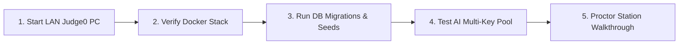

# Event Day Operations Runbook — ByteVerse 2026

**Audience:** Lead Technical Organizers, System Administrators, Network Engineers, Lab Proctors  
**Scope:** Execution timeline, operations checklist, failover protocols, and emergency procedures for event day.  
**Last Updated:** 2026-08-31

---

## 1. Pre-Event Infrastructure Checklist (T-Minus 2 Hours)



- [ ] **1. Boot Code Execution Server (Judge0):**
  - Verify Judge0 PC is online on LAN (e.g., `http://192.168.6.4:2358`).
  - Run verification command:
    ```bash
    curl -s http://192.168.6.4:2358/system_info
    ```
  - Confirm JSON output returns CPU cores, RAM, and available sandbox compilers.

- [ ] **2. Boot Main Application Server:**
  - Ensure PostgreSQL 16 and Redis 7 are running:
    ```bash
    docker compose up -d postgres redis
    ```
  - Run database seed and question validation scripts:
    ```bash
    npm run db:generate
    npm run db:push
    npm run db:seed
    npx tsx scripts/seed-round1-questions.ts
    npx tsx scripts/seed-round2-questions.ts
    ```
  - Start Next.js production server:
    ```bash
    npm run build
    npm run start
    ```

- [ ] **3. Validate AI Gateway Pool:**
  - Login as `admin@byteverse.dev` / `admin2026`.
  - Navigate to `/admin/ai` and verify that all Groq API keys show **HEALTHY** status with 0 initial errors.

---

## 2. Competition Stage Management Schedule

| Time Window | Operational Action | Admin Dashboard Step | Proctor Instructions |
|:---:|---|---|---|
| **09:00 - 09:30** | Participant Onboarding & Login | Verify participant registrations in `/admin/participants` | Assist students with team invite codes and seating. |
| **09:30 - 09:50** | **ROUND 1: Logical Thinking** (20m) | Navigate to `/admin/rounds` → Click **Start Round 1** | Ensure fullscreen mode is enabled on all client screens. |
| **09:50 - 09:55** | Round 1 Break Period (5m) | Round auto-transitions to ENDED | Allow participants 5-min stretch / water break. |
| **09:55 - 10:20** | **ROUND 2: AI Code Optimization** (25m) | Click **Start Round 2** in `/admin/rounds` | Monitor participant AI drawer usage if requested. |
| **10:20 - 10:25** | Round 2 Break Period (5m) | Round auto-transitions to ENDED | Prepare lab for Round 3 DSA challenges. |
| **10:25 - 11:00** | **ROUND 3: Debugging & Analysis** (35m) | Click **Start Round 3** in `/admin/rounds` | Monitor Judge0 queue throughput. |
| **11:00 - 11:05** | Round 3 Break Period (5m) | Round auto-transitions to ENDED | Short rest. |
| **11:05 - 11:50** | **ROUND 4: Data Structures** (45m) | Click **Start Round 4** in `/admin/rounds` | Assist with workstation issues immediately if any. |
| **11:50 - 11:55** | Round 4 Break Period (5m) | Round auto-transitions to ENDED | Final round briefing. |
| **11:55 - 12:30** | **ROUND 5: AI vs Human (Finale)** (35m) | Click **Start Round 5** in `/admin/rounds` | High vigilance on floor. |
| **12:30+** | Tournament Conclusion & Awards | Navigate to `/admin/leaderboard` → Export / Project Final Standings | Announce winners! |

---

## 3. Emergency & Incident Response Protocols

### Issue 1: Judge0 Sandbox Network Timeout / Disconnection
- **Symptom:** Submissions return `503 Judge0 execution engine is unreachable`.
- **Action:**
  1. Check network cables on Judge0 PC.
  2. In Judge0 terminal: `docker compose restart server workers`.
  3. Verify firewall allows port 2358 inbound on Judge0 PC.

### Issue 2: Groq API Rate Limit Exhaustion (429)
- **Symptom:** AI assistant responds with rate limit errors.
- **Action:**
  1. AI Gateway automatically fails over to the next key.
  2. If all keys exhausted, add emergency Groq keys to `.env` under `AI_API_KEYS` and restart server (`npm run start`).

### Issue 3: Accidental Anti-Cheat Station Lock
- **Symptom:** Participant screen locked with PIN prompt.
- **Action:**
  1. Proctor verifies no unauthorized tabs or phones are in use.
  2. Type master PIN `123456` or `2026` and press Enter.
  3. Station will unlock and resume fullscreen with a 4-second grace window.
